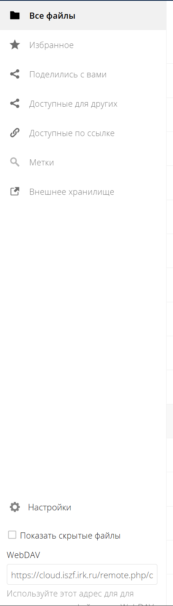

# Подключение облачного хранилища

## 1. OwnCloud


```
rclone config
```
### 1.1 Выбираем n
```
No remotes found, make a new one?
n) New remote
s) Set configuration password
q) Quit config
n/s/q> n
```

### 1.2 Даем название удаленному хранилищу
```
Enter name for new remote.
name> owncloud
```

### 1.3 Выбираем номер с WebDAV
```
Option Storage.
Type of storage to configure.
Choose a number from below, or type in your own value.

Storage> 42
```

### 1.4 Вписываем WebDAV URL адрес



```
Option url.
URL of http host to connect to.
E.g. https://example.com.
Enter a value.
url>
```

### 1.5 Выбираем OwnCloud

```
Option vendor.
Name of the WebDAV site/service/software you are using.
Choose a number from below, or type in your own value.
Press Enter to leave empty.
 1 / Nextcloud
   \ (nextcloud)
 2 / Owncloud
   \ (owncloud)
 3 / Sharepoint Online, authenticated by Microsoft account
   \ (sharepoint)
 4 / Sharepoint with NTLM authentication, usually self-hosted or on-premises
   \ (sharepoint-ntlm)
 5 / Other site/service or software
   \ (other)
vendor> 2
```

### 1.6 Вводим имя пользователя

```
Option user.
User name.
In case NTLM authentication is used, the username should be in the format 'Domain\User'.
Enter a value. Press Enter to leave empty.
user> <YOUR-USER-NAME>
```

### 1.7 Вводим наш пароль

```
Option pass.
Password.
Choose an alternative below. Press Enter for the default (n).
y) Yes, type in my own password
g) Generate random password
n) No, leave this optional password blank (default)
y/g/n> y
Enter the password:
password: <PASSWORD>
Confirm the password:
password: <PASSWORD>
```

### 1.8 Пропускаем 

```
Option bearer_token.
Bearer token instead of user/pass (e.g. a Macaroon).
Enter a value. Press Enter to leave empty.
bearer_token>

Edit advanced config?
y) Yes
n) No (default)
y/n> n
```

### 1.9 Сохраняем

```
Keep this "<REMOTE-NAME>" remote?
y) Yes this is OK (default)
e) Edit this remote
d) Delete this remote
y/e/d> y
```

## 2. Google Disk

```
rclone config
```

### 2.1 Выбираем n
```
No remotes found, make a new one?
n) New remote
s) Set configuration password
q) Quit config
n/s/q> n
```

### 2.2 Даем название удаленному хранилищу
```
Enter name for new remote.
name> gdrive
```

### 2.3 Выбираем номер с Google Drive
```
Option Storage.
Type of storage to configure.
Choose a number from below, or type in your own value.

Storage> 18
```

### 2.4 Вводим Client id
```
Option client_id.
Google Application Client Id
Setting your own is recommended.
See https://rclone.org/drive/#making-your-own-client-id for how to create your own.
If you leave this blank, it will use an internal key which is low performance.
Enter a value. Press Enter to leave empty.
client_id> Your-Client-Id
```

### 2.5 Вводим Client Secret
```
Option client_secret.
OAuth Client Secret.
Leave blank normally.
Enter a value. Press Enter to leave empty.
client_secret> Your-Client-Secret
```

### 2.6 Выбираем права доступа
```
Option scope.
Scope that rclone should use when requesting access from drive.
Choose a number from below, or type in your own value.
Press Enter to leave empty.

scope> 1
```

### 2.7  Пропускаем
```
Option service_account_file.
Service Account Credentials JSON file path.
Leave blank normally.
Needed only if you want use SA instead of interactive login.
Leading `~` will be expanded in the file name as will environment variables such as `${RCLONE_CONFIG_DIR}`.
Enter a value. Press Enter to leave empty.
service_account_file>
```

### 2.8 Не меняем доп. настройки
```
Edit advanced config?
y) Yes
n) No (default)
y/n> n
```

### 2.9 Не используем автоконфиг
```
Use auto config?
 * Say Y if not sure
 * Say N if you are working on a remote or headless machine

y) Yes (default)
n) No
y/n> n
```

### 2.10 Копируем предложенную команду и запускаем её на устройсте с браузером
```
Option config_token.
For this to work, you will need rclone available on a machine that has
a web browser available.
For more help and alternate methods see: https://rclone.org/remote_setup/
Execute the following on the machine with the web browser (same rclone
version recommended):
        rclone authorize "drive" "<HASH>"
Then paste the result.
Enter a value.
config_token> <YOUR-CONFIG-TOKEN>
```  
> После ввода предложенной команды переходим по ссылке из терминала и авторизируемся с аккаунта, который указали как test user, после этого вернуться в консоли появится нужный нам ключ

### 2.11 Если обычный диск, выбираем **n**, если корпоративный/командный, выбираем **y**
```
Configure this as a Shared Drive (Team Drive)?

y) Yes
n) No (default)
y/n> n
```

### 2.12 Сохраняем
```
Keep this "<REMOTE-NAME>" remote?
y) Yes this is OK (default)
e) Edit this remote
d) Delete this remote
y/e/d> y
```