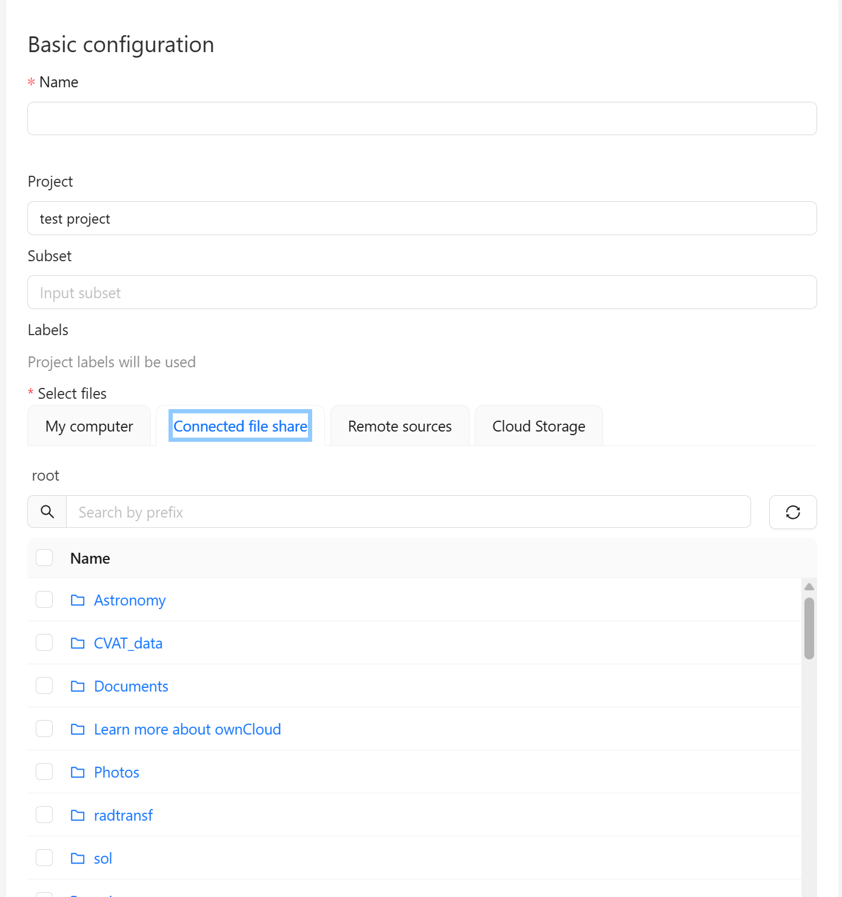

# Связываем owncloud с локальной папкой

## 1. Установить rclone

```
sudo apt install rclone
```

## 2. Подключить Owncloud по [этой документации](./connect_cloud.md)

## 3. Монтируем локальную папку с облаком

### 1 Способ: Простой фоновый запуск с логированием в ~/rclone.log
```
nohup rclone mount <REMOTE-NAME>: /mnt/owncloud --vfs-cache-mode full --allow-other --daemon &> ~/rclone.log &
```  
> Чтобы остановить, узнаем PID и убьем процесс
```
ps aux | grep rclone
kill <PID>
```

### 2 Способ: Автозапуск через systemd

#### 1. Создать файл сервис
```
sudo nano /etc/systemd/system/rclone.mount.service
```

#### 2. Внести в него следующее содержимое (User, REMOTE заменить на свои):
> Перед этим создать директорию logs `mkdir home/<USERNAME>/logs`
> Создать /mnt/owncloud и выдать права 
```
mkdir /mnt/owncloud
sudo chown $(whoami):$(whoami) /mnt/owncloud
```

```
[Unit]
Description=Mount OwnCloud for CVAT
After=network-online.target

[Service]
Type=simple
ExecStart=/usr/bin/rclone mount <REMOTE-NAME>: /mnt/owncloud \
  --vfs-cache-mode full \
  --allow-other \
  --dir-cache-time 12h \
  --log-file /home/<USERNAME>/logs/rclone.log \
  --log-level INFO

Restart=on-failure
User=<YOUR-USER-NAME>

[Install]
WantedBy=multi-user.target
```

#### 3. Ввести следующие команды
```
sudo systemctl daemon-reexec
sudo systemctl daemon-reload
sudo systemctl enable rclone.mount.service
sudo systemctl start rclone.mount.service
```  
> Проверка `systemctl status rclone-cvat.mount.service`

> После монтирования диска подождать около 3 минут перед следующими действиями

## 4. Создаем docker-compose.override.yml 
> Переходим в директорию cvat
```
cd runners/CVAT_runner/cvat
```

```
nano docker-compose.override.yml
```

## 5. Дополняем его следующим содержимым:
> ВАЖНО: volume должен быть и в cvat_server, чтобы отображалось в веб-интерфейсе, также должен быть в cvat_worker_import, чтобы корректно загружалось в самом бэке
```
volumes:
  cvat_share:
    driver_opts:
      type: none
      device: /mnt/owncloud
      o: bind

services:
  cvat_server:
    volumes:
      - cvat_share:/home/django/share
  cvat_worker_import:
    volumes:
      - cvat_share:/home/django/share
```

## 6. Перезапускаем docker
```
docker compose down && docker compose up -d
```

## Для добавления данных используем Connected file share при создании задачи

