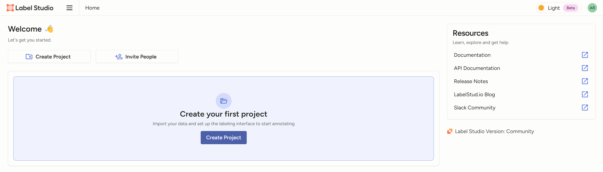
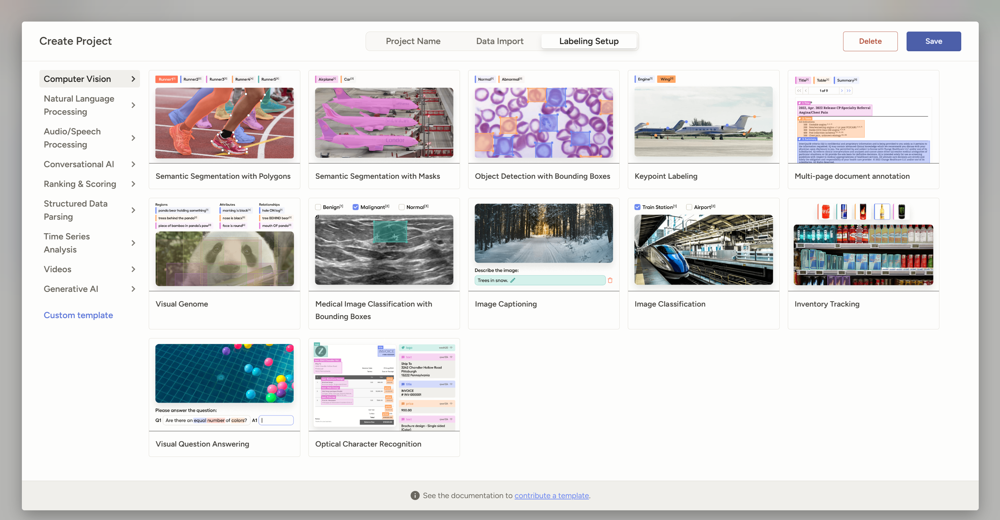

# Создание своего проекта и аннотация данных

1. Перейти в [веб интерфейс](http://localhost:8081) и зарегистрировать аккаунт, если это ещё не сделано

2. Нажать на кнопку Create Project

3. Дать проекту имя и описание

4. Перейти на вкладку Data Import и загрузить датасет

5. Выбрать готовый шаблон аннотации или при необходимости настроить свой (custom template)

6. Нажать кнопку save в правом верхнем углу

7. Далее нажать label all tasks

8. Выбрать нужный label в нижней части экрана и начать разметку

9. По окончании разметки, можно экспортировать данные разметки в удобном формате по нажатии на кнопку export