# Документация по Use-Case для CVAT и Label Studio

## Содержание

1. [Общий порядок действий](#общий-порядок-действий)
2. [Введение](#введение)
3. [Классификация изображений](#классификация-изображений)
4. [Детекция объектов с Bounding Box](#детекция-объектов-с-bounding-box)
5. [Семантическая сегментация](#семантическая-сегментация)
6. [Трекинг объектов в видео](#трекинг-объектов-в-видео)
7. [Классификация текста](#классификация-текста)
8. [Разметка сущностей в тексте](#разметка-сущностей-в-тексте-ner)
9. [Аннотирование аудио сегментов](#аннотирование-аудио-сегментов)
10. [Классификация аудио](#классификация-аудио)
11. [Классификация строк в таблице](#классификация-строк-в-таблице)
12. [Обнаружение аномалий во временных рядах](#обнаружение-аномалий-во-временных-рядах)

---

## Общий порядок действий

### CVAT

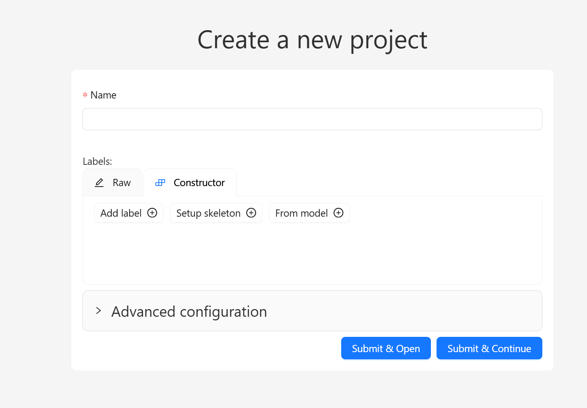

1. Создать проект.

   1. Дать название проекту

   2. Указать названия нужных меток

   3. Указать дополнительную конфигурацию (опционально)

   4. Нажать Submit & open

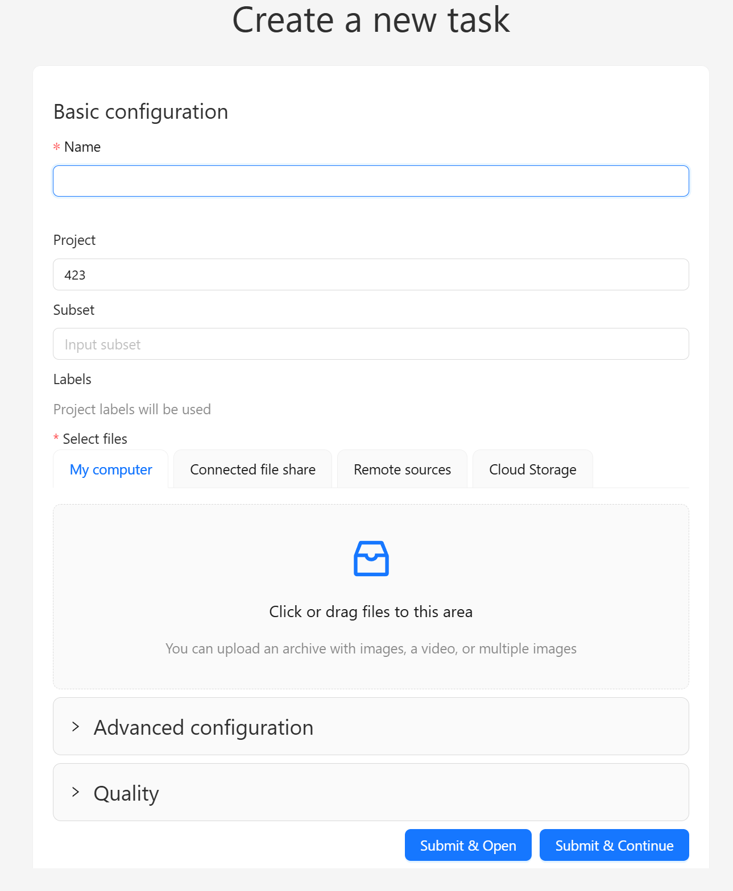

2. Создать задачу.

   1. Указать название задачи

   2. Привязать к нужному проекту

   3. Указать подвид датасета (опционально)

   4. Загрузить датасет

   5. Указать дополнительные настройки (опционально)

   6. Нажать Submit & open

> После этого появится Job

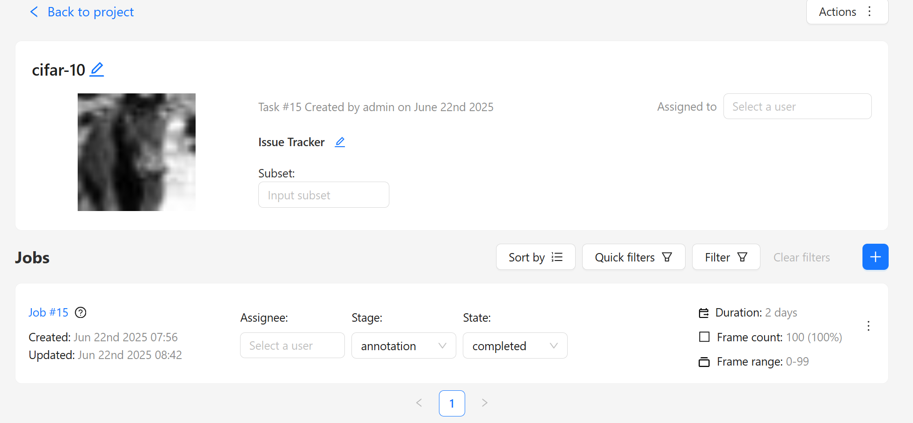

3. Открыть работу и начать разметку используя доступные инструменты в левой части экрана.

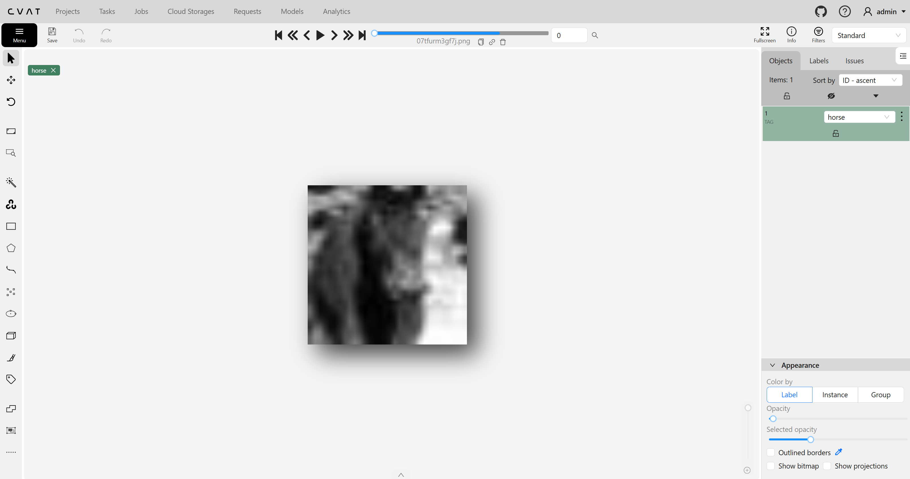

4. По окончании разметки, сохранить, нажав на кнопку Save в верхней левой части экрана

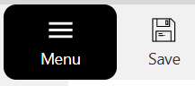

5. Экспорт данных.

    1. Жмём на Menu и выбираем Export job dataset

    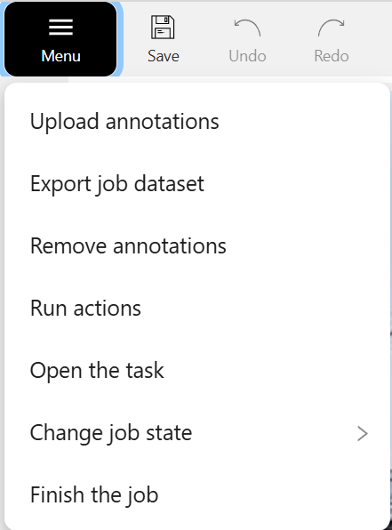

    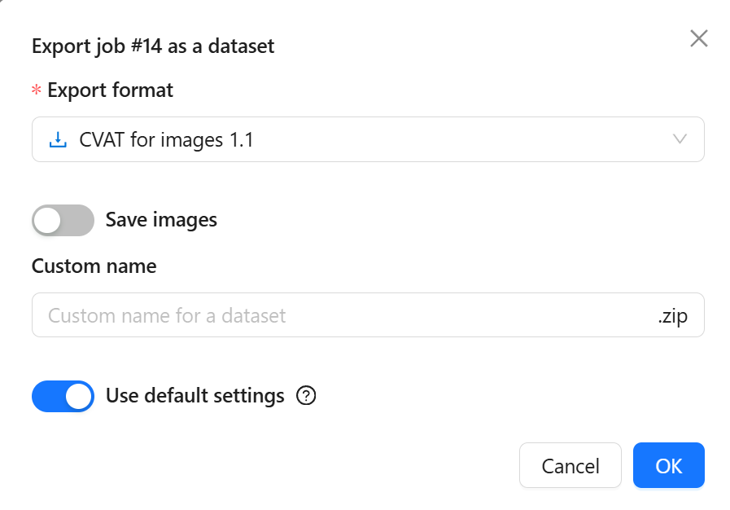

    2. Выбираемый нужный формат экспорта

    3. Выбираем, надо ли сохранять изображения и даем имя датасету

    4. Жмём OK, после этого в вкладке Requests появляется наш запрос, как только он обработается, можно скачать датасет

    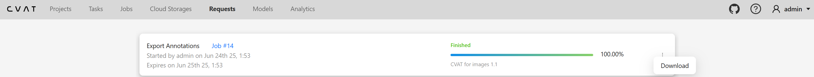

### Label Studio


1. Создать проект.

   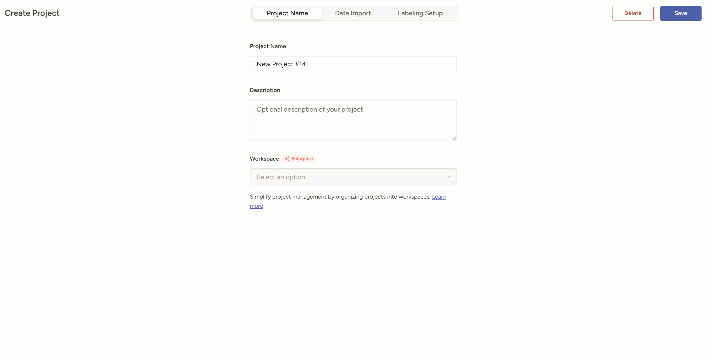

   1. Дать название проекту

   2. Указать описание проекта

   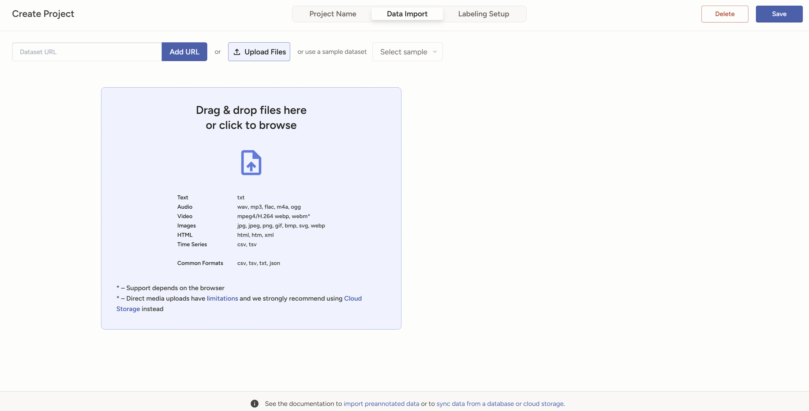

   3. Импортировать поддерживаемые данные

   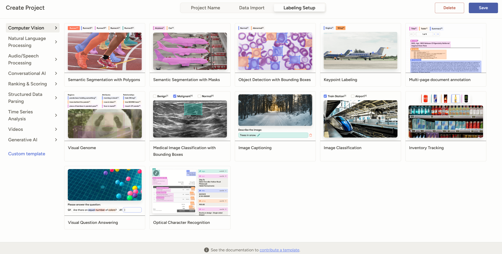

   4. Выбрать готовый шаблон или написать свой

2. Экспорт данных.

    1. Нажать Export

    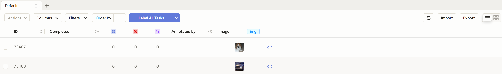

    2. Выбрать желаемый формат экспорта и экспортировать

    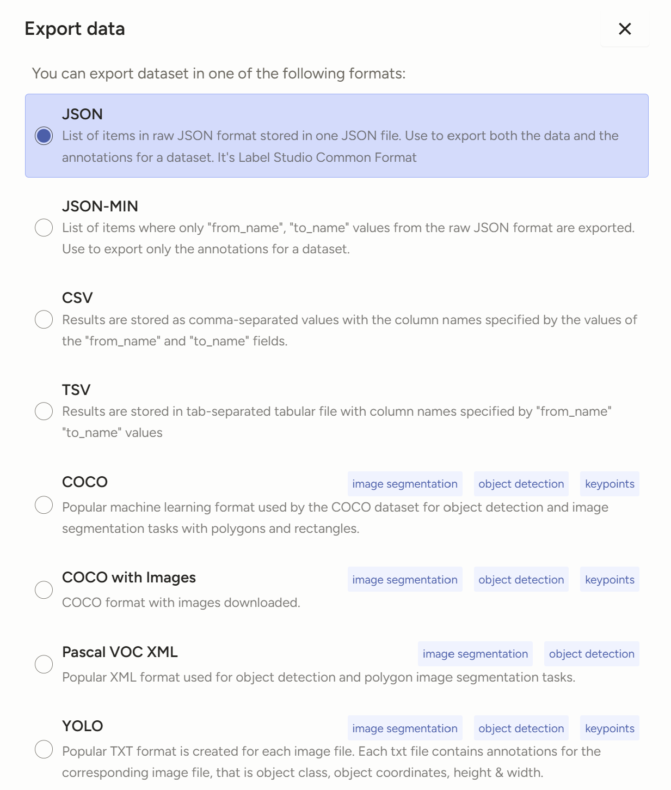

## Введение

**CVAT (Computer Vision Annotation Tool)** — специализированный инструмент для аннотации компьютерного зрения, оптимизированный для работы с изображениями и видео.

**Label Studio** — универсальная платформа для аннотации данных, поддерживающая изображения, текст, аудио, видео и структурированные данные.

### Основные различия:

- **CVAT**: Фокус на computer vision задачах, продвинутые инструменты для видео
- **Label Studio**: Универсальность, поддержка мультимодальных данных, гибкие шаблоны

---

## Классификация изображений

### CVAT

**Настройка проекта:**

1. Создайте новый проект в CVAT

2. Определите метки классов

3. Загрузите изображения


**Возможная конфигурация меток:**

```json
[
  {
    "name": "car",
    "id": 9,
    "color": "#2080c0",
    "type": "any",
    "attributes": []
  },
  {
    "name": "bicycle",
    "id": 10,
    "color": "#004040",
    "type": "any",
    "attributes": []
  },
  {
    "name": "person",
    "id": 11,
    "color": "#c06060",
    "type": "any",
    "attributes": []
  }
]
```

**Процесс разметки:**

1. Открыть задачу аннотации

2. Для каждого изображения выбрать соответствующий класс используя инструмент Setup tag  
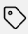

3. Сохранить аннотации

**Экспорт данных:**

- Основные форматы: CVAT for images, COCO, Pascal VOC, YOLO
- Экспорт через веб-интерфейс или API

### Label Studio

**Настройка проекта:**

1. Создать проект

2. Выбрать шаблон Image classification

3. Указать нужные метки

**Возможная конфигурация меток:**

```xml
<View>
  <Image name="image" value="$image"/>
  <Choices name="choice" toName="image">
    <Choice value="Adult content"/>
    <Choice value="Weapons" />
    <Choice value="Violence" />
  </Choices>
</View>
```

**Процесс разметки:**

1. Выбирать нужную метку
2. Переходить на следующее изображение

**Горячие клавиши:**

- `CTRL + Enter` - сохранить и перейти к следующему кадру
- [1-9] - быстрый выбор меток

**Экспорт данных:**

- Формат: JSON, CSV, YOLO, TSV
- Экспорт через веб-интерфейс или API

---

## Детекция объектов с Bounding Box

### CVAT

**Настройка проекта:**

1. Тип задачи: "Object Detection"
2. Настройка меток объектов
3. Загрузка изображений или видео

**Возможная конфигурация меток:**

```json
[
  {
    "name": "car",
    "id": 9,
    "color": "#2080c0",
    "type": "any",
    "attributes": []
  },
  {
    "name": "bicycle",
    "id": 10,
    "color": "#004040",
    "type": "any",
    "attributes": []
  },
  {
    "name": "person",
    "id": 11,
    "color": "#c06060",
    "type": "any",
    "attributes": []
  }
]
```

**Процесс разметки:**

1. Выбор инструмента "Rectangle" в режиме Shape

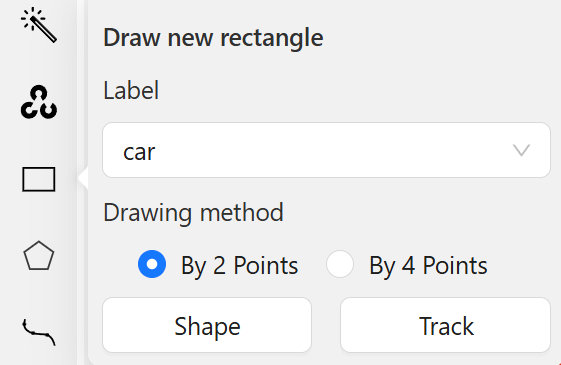

2. Обведение объектов прямоугольниками

3. Использование горячих клавиш для ускорения

**Горячие клавиши:**

- `F` - следующий кадр
- `D` - предыдущий кадр
- `Ctrl+S` - сохранить

**Экспорт данных:**

- Основные форматы: CVAT for images, COCO, Pascal VOC, YOLO
- Экспорт через веб-интерфейс или API

### Label Studio

**Настройка проекта:**

1. Создать проект

2. Выбрать шаблон Object Detection with Bbox

3. Указать нужные метки

**Возможный шаблон конфигурации:**

```xml
<View>
  <Image name="image" value="$image"/>
  <RectangleLabels name="label" toName="image">
    <Label value="Airplane" background="green"/>
    <Label value="Car" background="blue"/>
  </RectangleLabels>
</View>
```

**Процесс разметки:**

1. Выбор метки

2. Обведение объектов прямоугольниками

3. Использование горячих клавиш для ускорения

**Экспорт данных:**

- Формат: JSON, CSV, YOLO, TSV, COCO, Pascal VOC
- Экспорт через веб-интерфейс или API

---

## Семантическая сегментация

### CVAT

**Настройка проекта:**

1. Тип задачи: "Segmentation"
2. Настройка классов сегментации

**Процесс разметки:**

1. Инструмент "Polygon" для точной сегментации

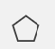

2. Инструмент "Brush" для быстрой разметки 

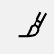

**Возможная онфигурация меток:**

```json
[
  {
    "name": "car",
    "id": 9,
    "color": "#2080c0",
    "type": "any",
    "attributes": []
  },
  {
    "name": "bicycle",
    "id": 10,
    "color": "#004040",
    "type": "any",
    "attributes": []
  },
  {
    "name": "person",
    "id": 11,
    "color": "#c06060",
    "type": "any",
    "attributes": []
  }
]
```
**Экспорт данных:**

- Основные форматы: CVAT for images, COCO, Pascal VOC, YOLO
- Экспорт через веб-интерфейс или API

### Label Studio

**Настройка проекта:**

1. Создать проект

2. Выбрать шаблон Semantic segmentation with polygons или Semantic segmentation with masks

3. Указать нужные метки

**Возможный шаблон для сегментации:**

```xml
<View>
  <Image name="image" value="$image" zoom="true"/>
  <BrushLabels name="tag" toName="image">
    <Label value="Airplane" background="rgba(255, 0, 0, 0.7)"/>
    <Label value="Car" background="rgba(0, 0, 255, 0.7)"/>
  </BrushLabels>
</View>

```

**Процесс разметки:**

1. Выбор метки

2. Обведение объектов маской или многоугольниками

3. Использование горячих клавиш для ускорения

**Экспорт данных:**

- Формат: JSON, CSV, YOLO, TSV, COCO
- Экспорт через веб-интерфейс или API

---

## Трекинг объектов в видео

### CVAT (Рекомендуемый)

**Настройка проекта:**

1. Тип задачи: "Video Tracking"

2. Загрузка видеофайлов

**Процесс трекинга:**

1. Создание трека на первом кадре

2. Создание ключевых bbox на кадрах

> Bbox между кадрами будет интерполироваться автоматически

**Возможная конфигурация меток:**

```json
[
  {
    "name": "person",
    "id": 11,
    "color": "#c06060",
    "type": "any",
    "attributes": []
  }
]
```

**Функции трекинга:**

- Автоматическая интерполяция
- Множественный трекинг объектов

**Экспорт данных:**

- Основные форматы: CVAT for video, COCO, Pascal VOC, YOLO
- Экспорт через веб-интерфейс или API

### Label Studio

**Настройка проекта:**

1. Создать проект

2. Выбрать шаблон Video object tracking

3. Указать нужные метки

4. Настроить количество FPS

**Процесс трекинга:**

1. Создание трека на первом кадре

2. Создание ключевых bbox на кадрах

> Bbox между кадрами будет интерполироваться автоматически

**Возможный шаблон для трекинга**

```xml
<View>
   <Labels name="videoLabels" toName="video" allowEmpty="true">
     <Label value="Man" background="blue"/>
     <Label value="Woman" background="red"/>
     <Label value="Other" background="green"/>
   </Labels>
   
   <Video name="video" value="$video" framerate="25.0"/>
   <VideoRectangle name="box" toName="video" />
</View>
```

**Экспорт данных:**

- Формат: JSON, CSV, YOLO, TSV
- Экспорт через веб-интерфейс или API

---

## Классификация текста

### CVAT

*Не поддерживается - CVAT предназначен для компьютерного зрения*

### Label Studio (Рекомендуемый)

**Настройка проекта:**

1. Создать проект
2. Выбрать шаблон Text Classification
3. Указать категории классификации
4. Настроить способ отображения текста

**Процесс классификации:**

1. Просмотр текстового документа
2. Выбор одной или нескольких категорий
3. Переход к следующему документу

**Возможный шаблон для классификации:**

```xml
<View>
  <Text name="text" value="$text"/>
  <View style="box-shadow: 2px 2px 5px #999;
               padding: 20px; margin-top: 2em;
               border-radius: 5px;">
    <Header value="Choose text sentiment"/>
    <Choices name="sentiment" toName="text"
             choice="single" showInLine="true">
      <Choice value="Positive"/>
      <Choice value="Negative"/>
      <Choice value="Neutral"/>
    </Choices>
  </View>
</View>
```

**Функции классификации:**

- Поддержка многоклассовой и многометочной классификации
- Настраиваемые категории

**Экспорт данных:**

- Основные форматы: JSON, CSV, TSV, YOLOv8 OBB
- Экспорт через веб-интерфейс или API

---

## Разметка сущностей в тексте (NER)

### CVAT
*Не поддерживается - CVAT предназначен для компьютерного зрения*

### Label Studio (Рекомендуемый)

**Настройка проекта:**

1. Создать проект
2. Выбрать шаблон Named Entity Recognition
3. Указать типы сущностей
4. Настроить цвета для каждого типа

**Импорт текста**

Чтобы Label  Studio его корректно отображал, он должен быть в json формате следующего вида:

```json
{
    "data": 
        {
            "text": 
            "сам текст"
        }
}
```

**Процесс разметки:**

1. Выбор типа сущности
2. Выделение текстового фрагмента

**Возможный шаблон для NER:**

```xml
<View>
  <Labels name="label" toName="text">
    <Label value="PER" background="red"/>
    <Label value="ORG" background="darkorange"/>
    <Label value="LOC" background="orange"/>
    <Label value="MISC" background="green"/>
  </Labels>

  <Text name="text" value="$text"/>
</View>
```

**Функции разметки:**

- Поддержка вложенных сущностей
- Автоматическое предложение меток

**Экспорт данных:**

- Основные форматы: JSON, CSV, TSV, CoNLL, YOLOv8 OBB
- Экспорт через веб-интерфейс или API

---

## Аннотирование аудио сегментов

### CVAT
*Не поддерживается - CVAT предназначен для компьютерного зрения*

### Label Studio (Рекомендуемый)

**Настройка проекта:**

1. Создать проект
2. Выбрать шаблон Speaker Segmentation
3. Указать типы аудио событий
4. Настроить временные интервалы

**Процесс аннотирования:**

1. Воспроизведение аудиофайла
2. Выделение временных сегментов
3. Назначение меток для каждого сегмента

**Возможный шаблон для аудио:**

```xml
<View>
  <Labels name="label" toName="audio" zoom="true" hotkey="ctrl+enter">
    <Label value="Speaker one" background="#00FF00"/>
    <Label value="Speaker two" background="#12ad59"/>
  </Labels>
  <Audio name="audio" value="$audio" />
</View>
```

**Функции аннотирования:**

- Точная временная разметка
- Воспроизведение выбранных сегментов
- Спектрограмма для визуализации

**Экспорт данных:**

- Основные форматы: JSON, CSV, TSV, YOLLOv8 OBB
- Экспорт через веб-интерфейс или API

---

## Классификация аудио

### CVAT
*Не поддерживается - CVAT предназначен для компьютерного зрения*

### Label Studio (Рекомендуемый)

**Настройка проекта:**

1. Создать проект
2. Выбрать шаблон Intent Classification
3. Указать категории классификации
4. Настроить параметры воспроизведения

**Процесс классификации:**

1. Прослушивание аудиозаписи
2. Выбор соответствующей категории
3. Переход к следующей записи

**Возможный шаблон для классификации:**

```xml
<View>
  <Labels name="labels" toName="audio">
    <Label value="Segment" />
  </Labels>

  <Audio name="audio" value="$audio"/>

  <Choices name="intent" toName="audio" perRegion="true" required="true">
    <Choice value="Question" />
    <Choice value="Request" />
    <Choice value="Satisfied" />
    <Choice value="Interested" />
    <Choice value="Unsatisfied" />
  </Choices>
</View>
```

**Функции классификации:**

- Поддержка различных аудиоформатов
- Возможность повторного воспроизведения

**Экспорт данных:**

- Основные форматы: JSON, CSV, TSV, YOLLOv8 OBB
- Экспорт через веб-интерфейс или API

---

## Классификация строк в таблице

### CVAT
*Не поддерживается - CVAT предназначен для компьютерного зрения*

### Label Studio (Рекомендуемый)

**Настройка проекта:**

1. Создать проект
2. Настроить шаблон табличных данных (по умолчанию в шаблонах его нет)
3. Указать категории для классификации
4. Выбрать столбцы для отображения

**Процесс классификации:**

1. Просмотр строки таблицы
2. Анализ значений в ячейках
3. Присвоение категории всей строке

**Возможный шаблон для таблиц:**

```xml
<View>
  <Header value="Job information:" />

  <Text name="job_title" value="$job_title" />
  <Text name="salary" value="Salary (USD): $salary_in_usd" />
  <Text name="experience_level" value="$experience_level" />

  <Choices name="salary_level" toName="job_title" choice="single" showInLine="true">
    <Choice value="Low Salary" />
    <Choice value="Medium Salary" />
    <Choice value="High Salary" />
  </Choices>
</View>
```

**Функции классификации:**

- Отображение табличных данных
- Фильтрация и сортировка
- Поддержка различных форматов данных

**Экспорт данных:**

- Основные форматы: JSON, CSV, TSV
- Экспорт через веб-интерфейс или API

---

## Обнаружение аномалий во временных рядах

### CVAT
*Не поддерживается - CVAT предназначен для компьютерного зрения*

### Label Studio (Рекомендуемый)

**Настройка проекта:**

1. Создать проект
2. Можно выбрать шаблон Outliers & Anomaly Detection и настроить в нем столбцы. (Настроить timeFormat, timeColumns, Channels)
3. Указать типы аномалий
4. Настроить параметры визуализации

**Процесс обнаружения:**

1. Просмотр графика временного ряда
2. Выделение аномальных участков
3. Классификация типа аномалии

**Возможный шаблон для временных рядов:**

```xml
<View>
    <!-- Control tag for region labels -->
    <TimeSeriesLabels name="label" toName="ts">
      
    <Label value="low pollution" background="#cfff9e"/><Label value="medium pollution" background="#d39e0d"/><Label value="high pollution" background="#ff6b6b"/><Label value="temp drop" background="#00ad91"/><Label value="temp rise" background="#c75c05"/></TimeSeriesLabels>

    <!-- Object tag for time series data source -->
    <TimeSeries name="ts" valueType="url" value="$csv" sep="," timeColumn="date" timeFormat="%Y-%m-%d %H:%M:%S" timeDisplayFormat="%Y-%m-%d" overviewChannels="pollution,temp">

        <Channel column="pollution" units="AQI" displayFormat=",.1f" strokeColor="#1f77b4" legend="Pollution"/>

        <Channel column="temp" units="°C" displayFormat=",.1f" strokeColor="#ff7f0e" legend="Temperature"/>
    </TimeSeries>
</View>
```

**Функции обнаружения:**

- Интерактивная визуализация графиков
- Выделение временных интервалов
- Zoom и навигация по временной шкале

**Экспорт данных:**

- Основные форматы: JSON, CSV, TSV, YOLO v8 OBB
- Экспорт через веб-интерфейс или API

---

**Ключевые рекомендации:**

1. Для CV задач с видео — используйте CVAT
2. Для мультимодальных данных — используйте Label Studio
3. Всегда настраивайте валидацию качества аннотаций
4. Используйте готовые шаблоны для ускорения работы
5. Регулярно экспортируйте данные для создания бэкапов
